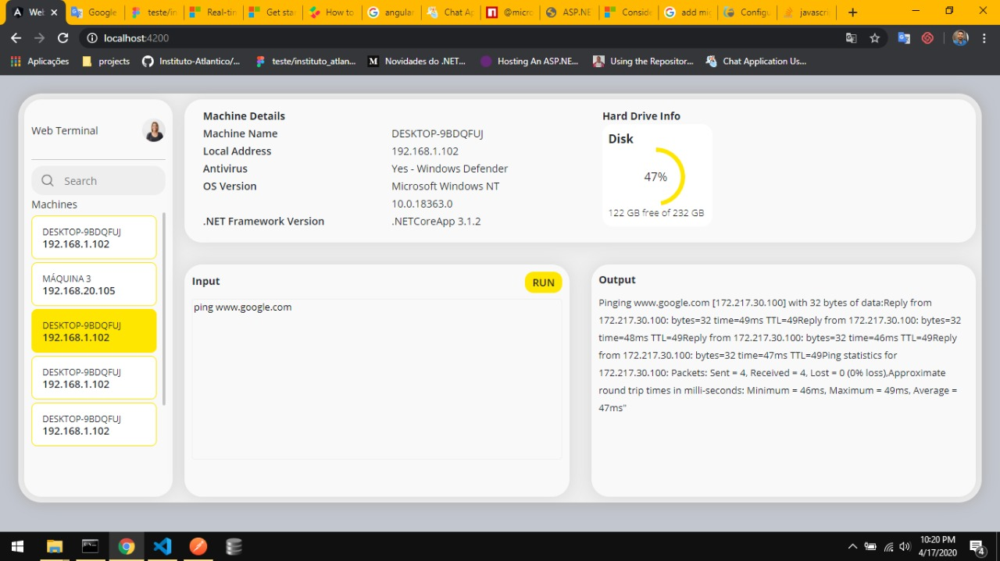

# Web CLI

Installation and testing steps:

- First you need install the services on Windows. (CoreAPI and ServiceAPI)
- After that, just run the angular project locally or host it on an application server.
- The registration of the client machines is done after installing the service.

When running the angular application, you will see something like this:

